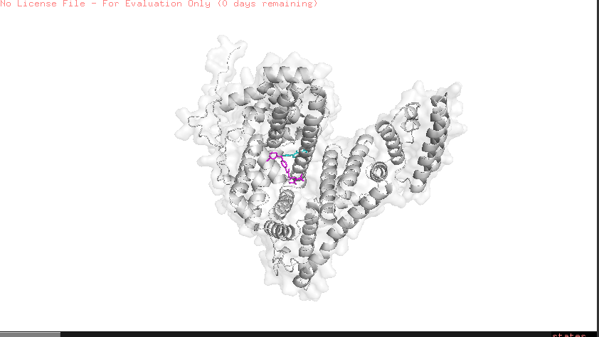
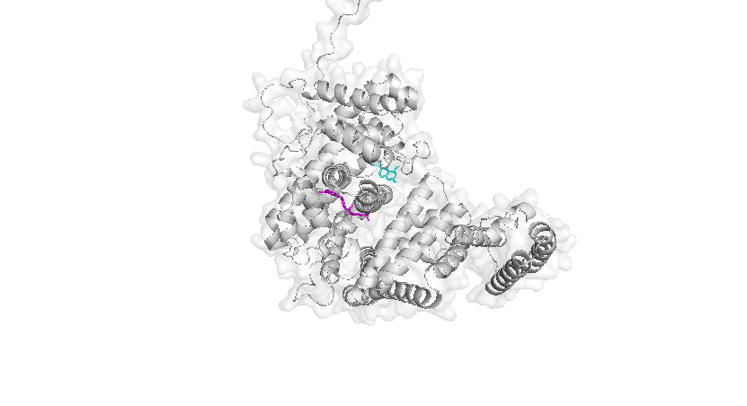

# Comparative Molecular Docking Analysis of Clinical and Natural Inhibitors against Human Alpha-Fetoprotein (AFP)

## 📌 Project Overview
Following the successful 3D structural prediction of human Alpha-Fetoprotein (AFP) in Project 01, this study executes a computational molecular docking simulation. The objective is to map, evaluate, and compare the thermodynamic binding efficacies of an FDA-approved systemic chemotherapy drug versus a natural dietary compound within the active structural folds of AFP.

* **Target Receptor:** Human Alpha-Fetoprotein (AFP) [Monomeric structural model predicted via AlphaFold2 / ColabFold]
* **Ligand 1 (Positive Control):** Sorafenib (Standard first-line chemotherapy for advanced Hepatocellular Carcinoma)
* **Ligand 2 (Experimental Candidate):** Genistein (Soy-derived natural phytoestrogen/isoflavone)

---

## 🛠️ Methodology & Simulation Parameters

1. **Receptor Preparation:** The highest-confidence AFP structural model (`rank_001.pdb`) was imported into PyMOL. Background noise and water molecules were completely evacuated using the `remove solvent` command to isolate a clean monomeric protein chain.
2. **Ligand Preparation:** Structural configurations for Sorafenib and Genistein were retrieved from the PubChem database. 
3. **Docking Simulation:** Calculations were executed using the AutoDock Vina engine via the Webina deployment interface. Both ligands were tested within a standardized, three-dimensional search space targeted at the high-capacity transport domain (Domain III).
4. **Grid Box Configuration:** * **Dimensions:** 23Å × 22Å × 23Å bounding volume.
   * **Target Site:** Positioned precisely over the multi-ligand binding cleft of Domain III to allow unconstrained, blind-docking optimization within that domain region.

---

## 📊 Docking Results & Thermodynamic Scoring

The binding orientations were ranked based on their Gibbs free energy / lowest binding affinity score ($\Delta G$ measured in kcal/mol). A more negative score indicates a tighter, more stable receptor-ligand complex.

| Ligand Candidate | Compound Class | PubChem CID | Top Binding Affinity (kcal/mol) | Structural Binding Characterization |
| :--- | :--- | :---: | :---: | :--- |
| **Sorafenib** | Synthetic Kinase Inhibitor | 216239 | **-9.81** | Occupies the deep, internal hydrophobic core cavity; maximizes heavy halogen surface contact. |
| **Genistein** | Natural Flavonoid | 5280961 | **-7.78** | Anchors into an alternative outer-wall surface pocket, isolated by a structural alpha-helix barrier. |

---

## 🔍 Structural Visualization & Spatial Analysis

## Dual-Ligand Topographical Mapping (Frontal view)

### Dual-Ligand Topographical Mapping (Top-Down Perspective)

### Key Structural Insights:
* **Spatial Segregation:** The top-down bird's-eye perspective reveals a definitive non-competitive, allosteric binding architecture. Rather than competing for identical amino acid residues within the exact same grid space, the two ligands successfully anchored into separate pockets.
* **Sorafenib Orientation (Magenta):** Buries itself deeply into the primary, internal hydrophobic cleft of the domain, yielding a highly stable affinity score of -9.81 kcal/mol.
* **Genistein Orientation (Cyan):** Targets a distinct surface pocket located on the exterior/reverse wall of the domain, registering a strongly favorable binding score of -7.78 kcal/mol.

---

## 💡 Discussion & Clinical Implications

This comparative study successfully validated the viability of AFP's transport cavities using a dual-ligand docking approach. While the engineered synthetic framework of **Sorafenib** yields a superior binding energy (-9.81 kcal/mol), the natural compound **Genistein** demonstrates highly significant binding capability (-7.78 kcal/mol) at a completely independent allosteric site. 

Because an alpha-helical structural wall physically isolates the two compounds, they do not stereochemically overlap. This finding opens up intriguing avenues for **synergistic combination therapy** in computational oncology: administering both agents concurrently could theoretically allow Genistein to act as an allosteric modulator while Sorafenib blocks the primary internal cargo transport pathway of Alpha-Fetoprotein, potentially improving therapeutic efficacy against liver cancer cells.
